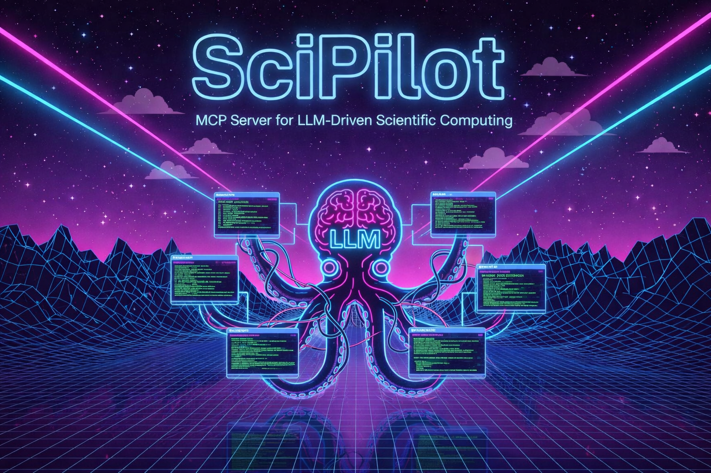

# SciPilot

Natural language interface for scientific command-line tools via Model Context Protocol (MCP).



Requires Python 3.13+.
> ⚠️ **Security Warning**: Tool YAML files execute with full shell privileges. Only load tool descriptors you trust and have reviewed. User inputs are substituted directly into shell command templates.

## Quick Start

```bash
git clone https://github.com/grebenyyk/scipilot
cd scipilot
pip install -e .
scipilot --tools-dir ./tools
```

## Usage

1. Add tool descriptors to `tools/` (see `examples/raspa.yaml`)
2. Connect MCP client (Claude Desktop, VS Code, etc.)
3. Ask in natural language:
   - "Run nitrogen adsorption on MOF-5 at 77K and 1 bar"
   - "Compare results from yesterday's simulations"

## Tool Descriptor Format

See `examples/` for complete tool descriptors.

```yaml
tool:
  name: mytool
  binary: mytool
  
operations:
  - name: run_simulation
    description: "Run a simulation"
    inputs:
      - name: input_file
        type: file
        required: true
    outputs:
      - name: result
        path: "output.txt"
        extract_pattern: "Result: ([0-9.]+)"
```

## Project Structure

```
scipilot/
├── server.py          # MCP server entry point
├── tool_loader.py     # YAML parsing, tool discovery
├── executor.py        # Subprocess execution, output parsing
└── models.py          # Dataclasses for tool descriptors

tools/                 # Your tool descriptors (gitignored)
examples/              # Example descriptors
```

## Development

```bash
# Run tests
pytest

# Type checking
mypy scipilot/

# Format
ruff format .
```

## License

MIT
